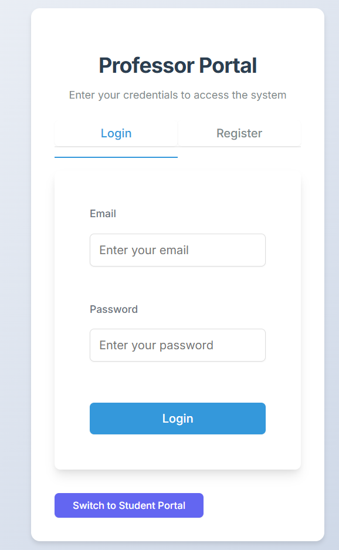

# Assignment Plagiarism Detection System

A full-stack application designed to help educators detect plagiarism in student assignments. The system offers an intuitive interface for professors to manage assignments and for students to submit their work, with built-in plagiarism detection capabilities.



## Features

- **User Authentication**: Separate portals for students and professors
- **Assignment Management**: Create, update, and track assignments
- **Submission Handling**: Students can upload files and track submission status
- **Plagiarism Detection**: Advanced algorithm to detect similarities between submissions
- **Grading System**: Evaluate and provide feedback on student work
- **Modern UI**: Clean, responsive interface with intuitive navigation

## Technology Stack

- **Frontend**: React.js with modern UI components
- **Backend**: Flask (Python) RESTful API
- **Database**: MongoDB for flexible document storage
- **Authentication**: JWT-based secure authentication
- **File Storage**: Local file system with cloud storage options
- **Deployment**: Vercel (frontend) and Render (backend)

## Screenshots

### Student Dashboard


### Professor Dashboard


### Assignment Creation


### Submission View


### Plagiarism Report


## Installation and Setup

### Prerequisites
- Node.js (v14+)
- Python (v3.8+)
- MongoDB
- Git

### Backend Setup

1. **Clone the repository**
   ```bash
   git clone https://github.com/your-username/assignment-plagiarism-detection.git
   cd assignment-plagiarism-detection
   ```

2. **Set up Python virtual environment**
   ```bash
   cd flask-server
   python -m venv venv
   source venv/bin/activate  # On Windows: venv\Scripts\activate
   ```

3. **Install dependencies**
   ```bash
   pip install -r requirements.txt
   ```

4. **Set up environment variables**
   Create a `.env` file in the `flask-server` directory:
   ```
   FLASK_ENV=development
   SECRET_KEY=your-dev-secret-key
   MONGODB_URI=mongodb://localhost:27017/assignment_checker
   ```

5. **Start the backend server**
   ```bash
   python app.py
   ```
   The server will run on http://localhost:5000

### Frontend Setup

1. **Navigate to the client directory**
   ```bash
   cd client
   ```

2. **Install dependencies**
   ```bash
   npm install
   ```

3. **Set up environment variables**
   Create a `.env` file in the `client` directory:
   ```
   REACT_APP_API_URL=http://localhost:5000/api
   ```

4. **Start the frontend development server**
   ```bash
   npm start
   ```
   The application will open in your browser at http://localhost:3000

## Deployment Guide

### Backend Deployment (Render)

1. **Sign up for Render**
   - Create an account at [render.com](https://render.com)
   - Connect your GitHub repository

2. **Create a new Web Service**
   - Choose your repository
   - Configure the service:
     - **Build Command**: `pip install -r flask-server/requirements.txt`
     - **Start Command**: `cd flask-server && gunicorn -c gunicorn.conf.py app:app`

3. **Configure environment variables**
   - `FLASK_ENV`: `production`
   - `SECRET_KEY`: [secure random string]
   - `MONGODB_URI`: [MongoDB connection string]
   - `BACKEND_URL`: [your Render service URL]
   - `FRONTEND_URLS`: [your Vercel frontend URL]

### Frontend Deployment (Vercel)

1. **Sign up for Vercel**
   - Create an account at [vercel.com](https://vercel.com)
   - Connect your GitHub repository

2. **Import your project**
   - Configure:
     - **Framework**: Create React App
     - **Root Directory**: client
     - **Build Command**: npm run build
     - **Output Directory**: build

3. **Configure environment variables**
   - `REACT_APP_API_URL`: [your Render backend URL]/api

4. **Deploy**
   - Click "Deploy" and wait for the build to complete

## Usage Guide

### For Professors

1. **Register/Login** through the professor portal
2. **Create assignments** with specific requirements
3. **View submissions** from your students
4. **Check plagiarism reports** to identify similarities
5. **Grade submissions** and provide feedback

### For Students

1. **Register/Login** through the student portal
2. **View assigned** coursework and deadlines
3. **Submit assignments** before due dates
4. **Check grades** and feedback from professors

## Contributing

1. Fork the repository
2. Create a feature branch (`git checkout -b feature/amazing-feature`)
3. Commit your changes (`git commit -m 'Add some amazing feature'`)
4. Push to the branch (`git push origin feature/amazing-feature`)
5. Open a Pull Request

## License

This project is licensed under the MIT License - see the LICENSE file for details.

## Acknowledgments

- Special thanks to all contributors who have helped build this system
- Inspired by the need for better plagiarism detection in educational settings